# Desafio DIO - Criando um Phishing para capturar senhas de login do facebook.
Obs.: Atividade meramente com objetivo didático de realizar a tarefa proposta pela DIO na Formação Cybersecurity Specialist.

Detalhes da formação
Aprenda na prática a utilizar ferramentas e técnicas voltadas para a área de Cibersegurança, abrindo grandes possibilidades de carreira nesse mercado que vem crescendo exponencialmente. Na trilha iremos abordar os conceitos e fundamentos de Cibersegurança, Sistemas Operacionais, Redes de computadores, Ferramentas de testes de intrusão e Simulações de ataques em redes. Ao final dessa jornada você estará capacitado(a) para criar aplicações e soluções mais seguras, como também para iniciar a sua carreira na área. Em relação aos pré-requisitos para a Formação, não há impedimentos. Contudo, conhecer uma linguagem de programação e ter noções básicas de linhas de comando e Linux é um excelente começo. Bora lá?

# Phishing para captura de senhas do Facebook
Ferramentas
- Kali Linux
- setoolkit
- PyPhiser

# Configurando o Phishing no Kali Linux
- Acesso root: sudo su
- Iniciando o setoolkit: setoolkit
- Tipo de ataque: Social-Engineering Attacks
- Vetor de ataque: Web Site Attack Vectors
- Método de ataque: Credential Harvester Attack Method 
- Método de ataque: Site Cloner
- Obtendo o endereço da máquina: $ ip -br a
- URL para clone: http://www.facebook.com

# Configurando o PyPhiser no Kali Linux
- Pesquisando outra ferramenta: https://gitlab.com/KasRoudra/PyPhisher
- Baixando o repositório: $ git clone https://gitlab.com/KasRoudra/PyPhisher.git
- Acessando o diretório e listando o conteúdo:
- Rodando o PyPhisher: $ python pyphisher.py
- Do you have loclx authtoken? : n
- Acessando a interface do PyPhiser:
- Facebook Traditional: 1
- Do you want OTP Page? [y/n]: n
- Enter shadow url (for social media preview)[press enter to skip] : Enter
- Enter redirection url[press enter to skip] : Enter
- Are you sure you want to continue connecting (yes/no/[fingerprint])? : Esc
- Acessando o link gerado: [https://sealed-badly-extract-nitrogen.trycloudflare.com]
- Inserindo as credenciais na página clonada: usuario@face.com / senhasecreta123
- Redirecionamento para a página real do facebook:
- Coletando dados da vítima:
- Coletando informações de login da vítima:
- Informações registradas: creds.txt

# Resutados:

# SET no Kali Linux

- Acesso root: sudo su
  

- Iniciando o setoolkit: setoolkit
  

  
- Tipo de ataque: Social-Engineering Attacks

- Vetor de ataque: Web Site Attack Vectors

  
- Método de ataque: Credential Harvester Attack Method

  
- Método de ataque: Site Cloner

  
- Obtendo o endereço da máquina: $ ip -br a

  
- URL para clone: http://www.facebook.com

- Acessando a página clonada: http://192.168.2.127/

- Inserindo credenciais: usuario@face.com / senhasecreta123

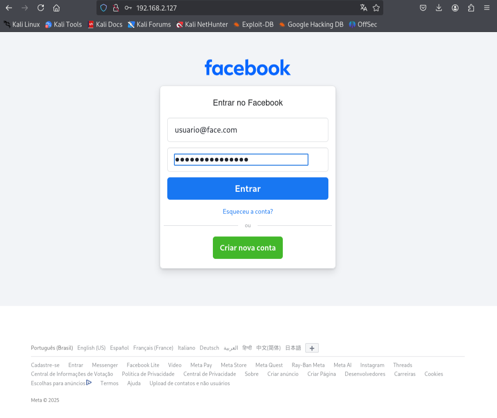

- Senhas Capturadas: http://www.facebook.com | fail

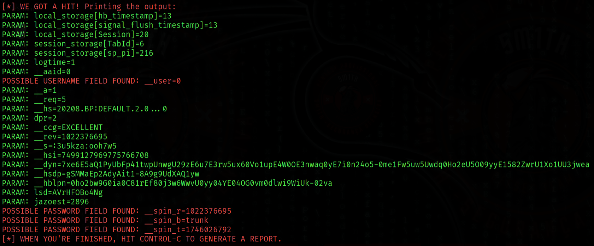

# PyPhiser no Kali Linux

- Pesquisando outra ferramenta: https://gitlab.com/KasRoudra/PyPhisher

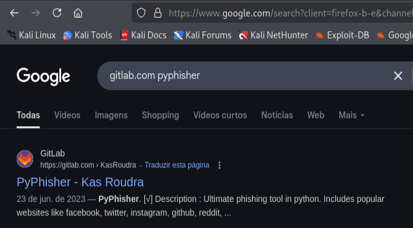

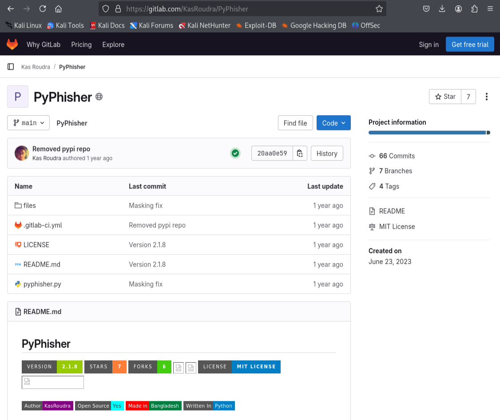

- Baixando o repositório: $ git clone https://gitlab.com/KasRoudra/PyPhisher.git

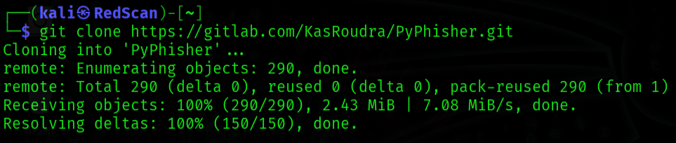

- Acessando o diretório e listando o conteúdo:

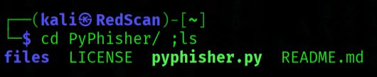

- Rodando o PyPhisher: $ python pyphisher.py

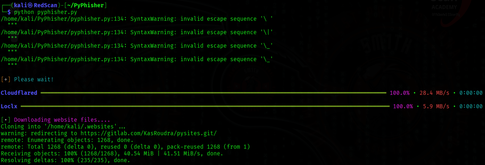

- Do you have loclx authtoken? : n

- Acessando a interface do PyPhiser:

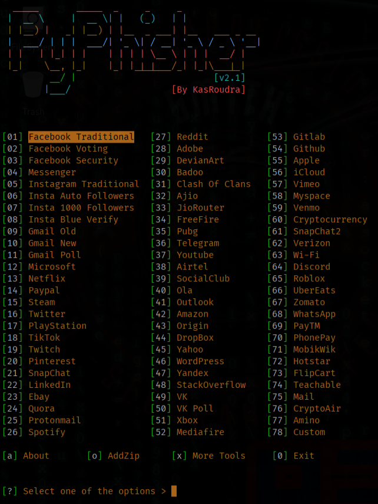

- Facebook Traditional: 01

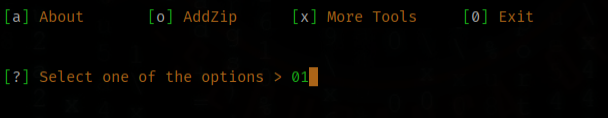

- Do you want OTP Page? [y/n]: n

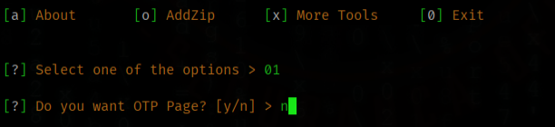

- Enter shadow url (for social media preview)[press enter to skip] : Enter

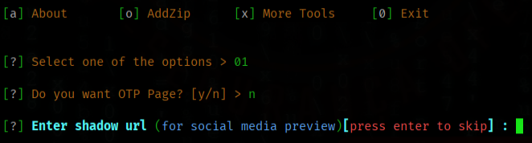

- Enter redirection url[press enter to skip] : Enter

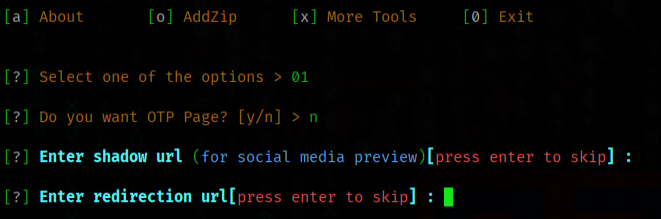

- Are you sure you want to continue connecting (yes/no/[fingerprint])? : Esc

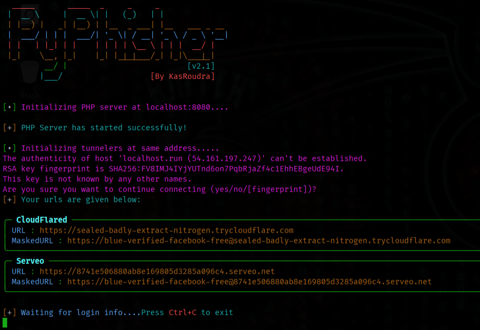

- Acessando o link gerado: [https://sealed-badly-extract-nitrogen.trycloudflare.com]

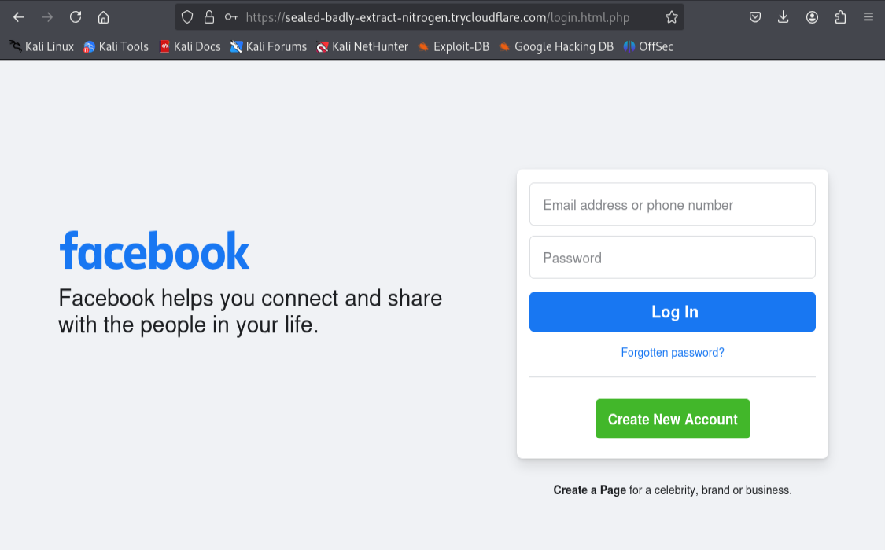

- Inserindo as credenciais na página clonada: usuario@face.com / senhasecreta123

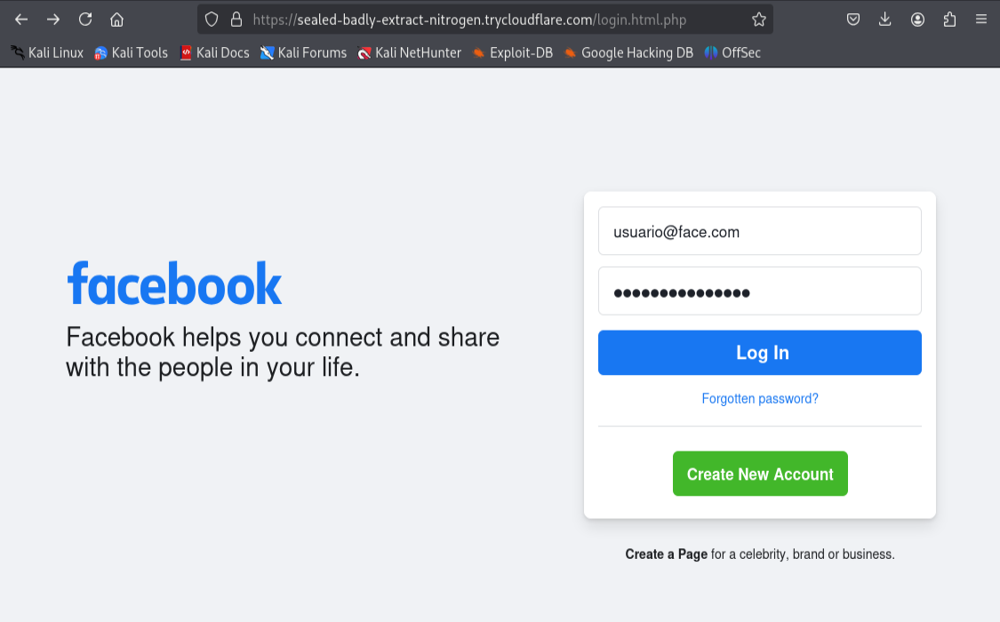

- Redirecionamento para a página real do facebook:

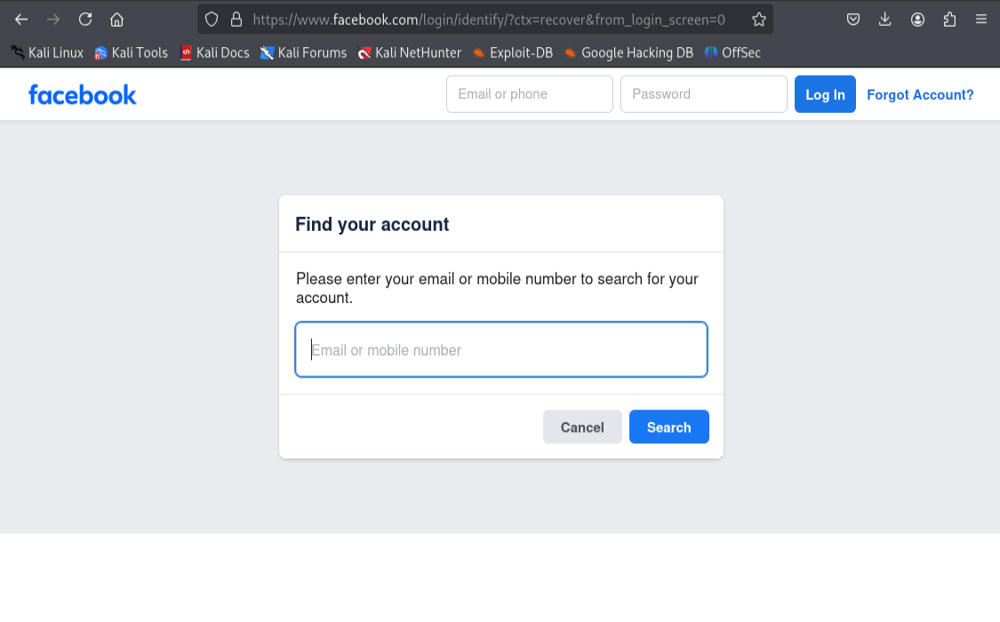

- Coletando dados da vítima:

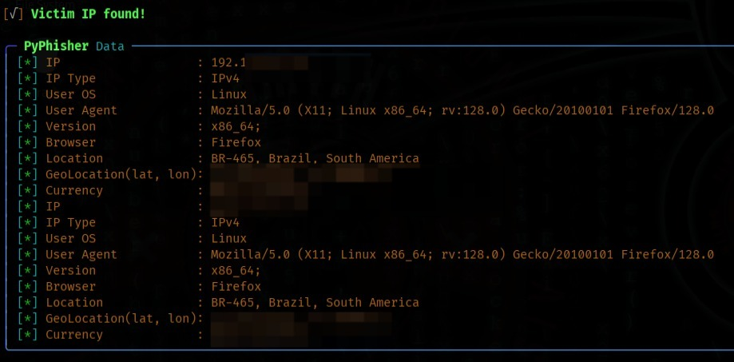

- Coletando informações de login da vítima:

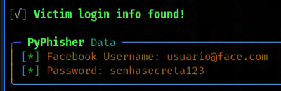

- Informações registradas: creds.txt

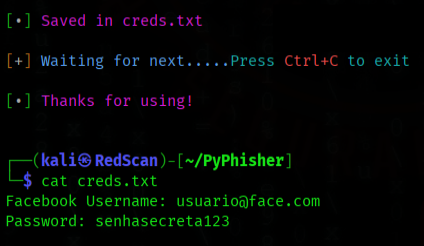
