# Desafio DIO - Criando um Phishing para capturar senhas de login do facebook.

#Phishing para captura de senhas do Facebook
Ferramentas
- Kali Linux
- setoolkit

# Configurando o Phishing no Kali Linux
- Acesso root: sudo su
- Iniciando o setoolkit: setoolkit
- Tipo de ataque: Social-Engineering Attacks
- Vetor de ataque: Web Site Attack Vectors
- Método de ataque: Credential Harvester Attack Method 
- Método de ataque: Site Cloner
- Obtendo o endereço da máquina: $ ip -br a
- URL para clone: http://www.facebook.com

# Resutados:
- Acesso root: sudo su
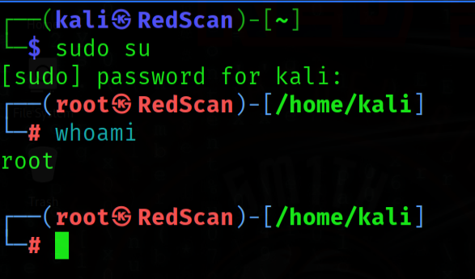

- Iniciando o setoolkit: setoolkit
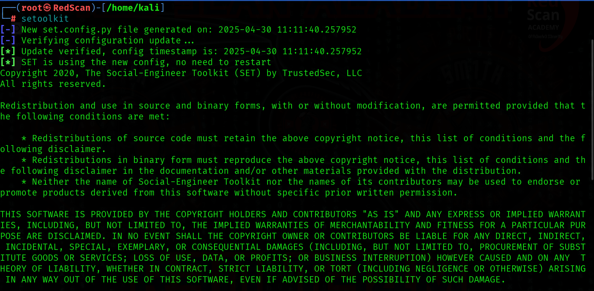
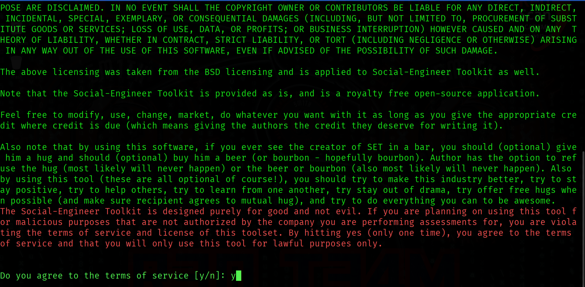
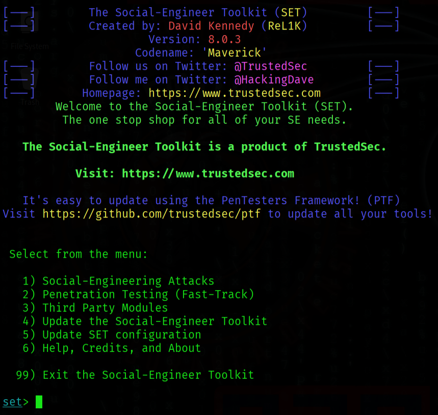
  
- Tipo de ataque: Social-Engineering Attacks
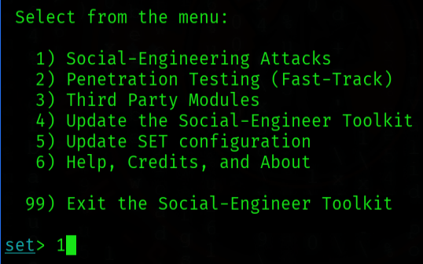
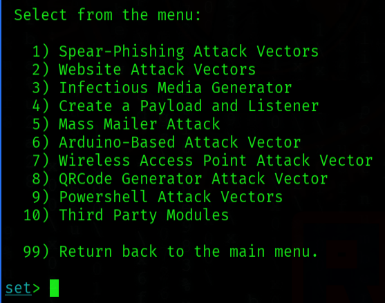

- Vetor de ataque: Web Site Attack Vectors
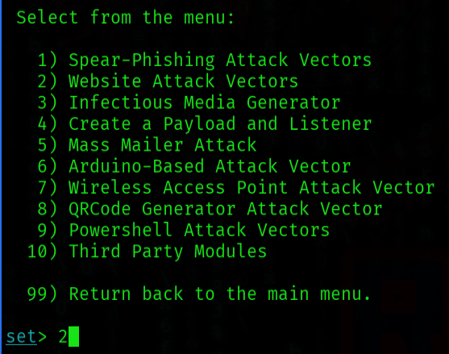
  
- Método de ataque: Credential Harvester Attack Method
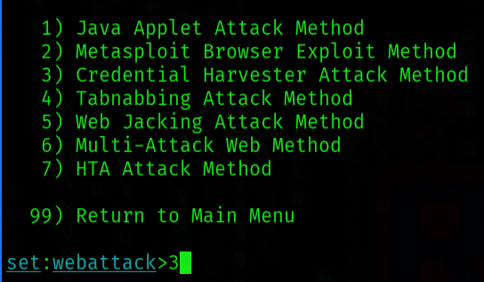
  
- Método de ataque: Site Cloner
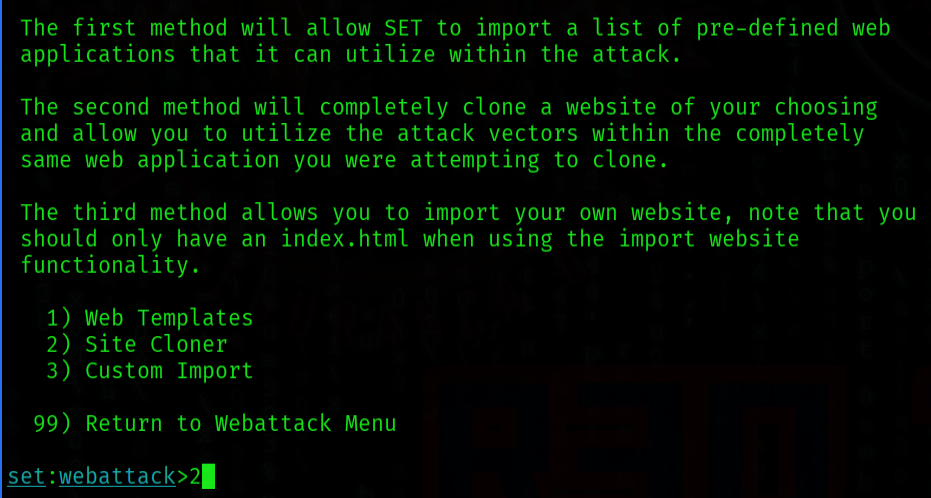
  
- Obtendo o endereço da máquina: $ ip -br a
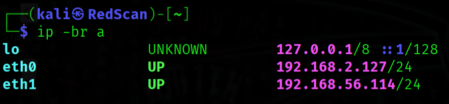
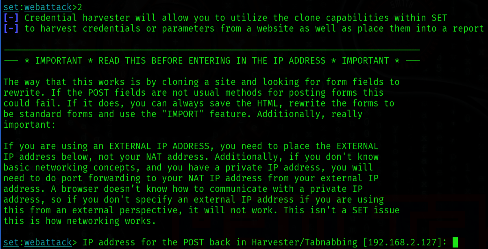
  
- URL para clone: http://www.facebook.com
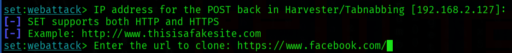
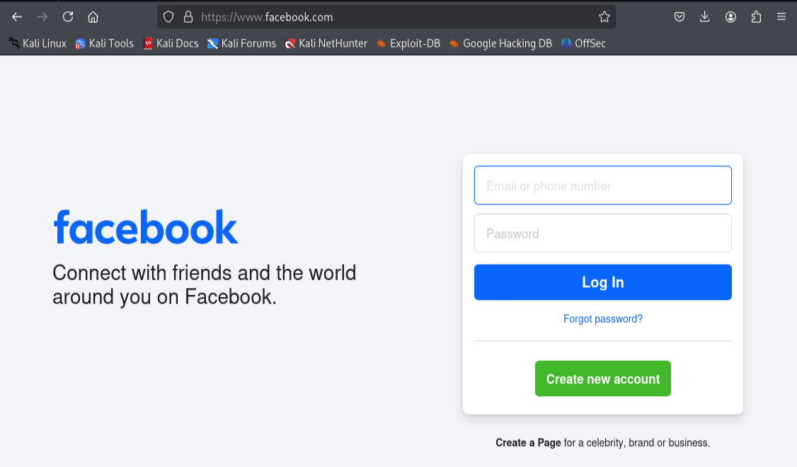
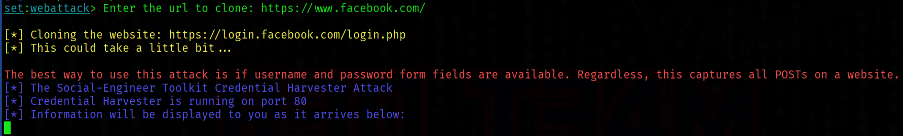

-Acessando a página clonada: http://192.168.2.127/
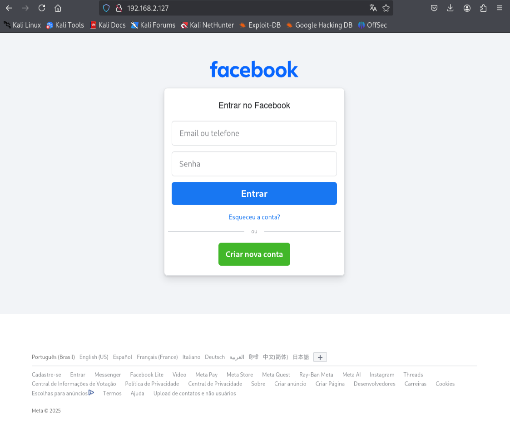

-Inserindo credenciais: usuario@face.com / senhasecreta123

- Senhas Capturadas: http://www.facebook.com

